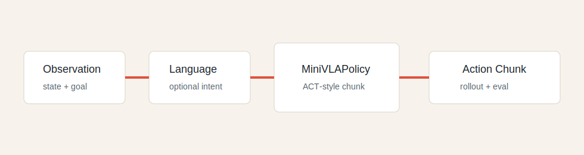
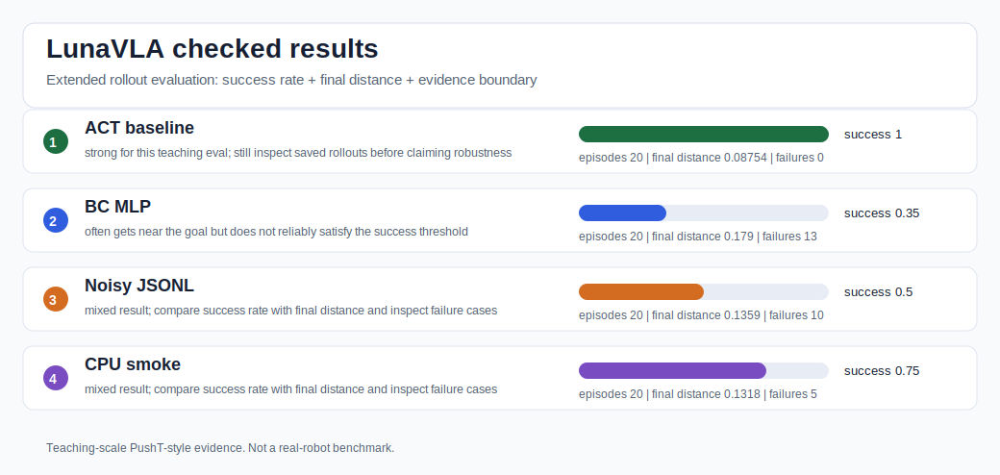
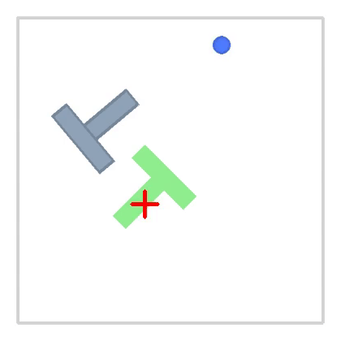
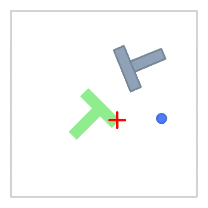
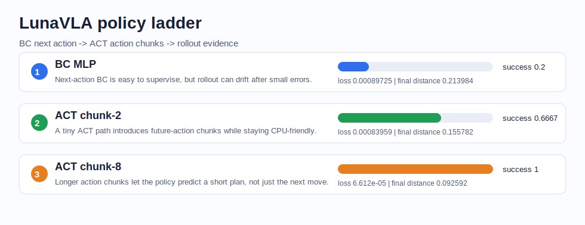
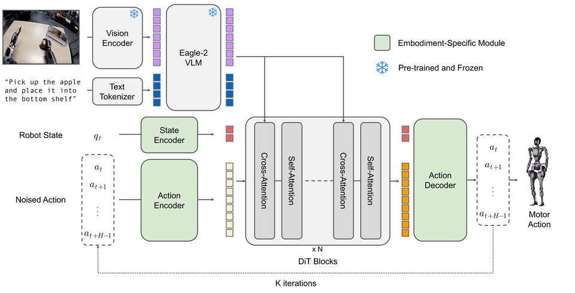
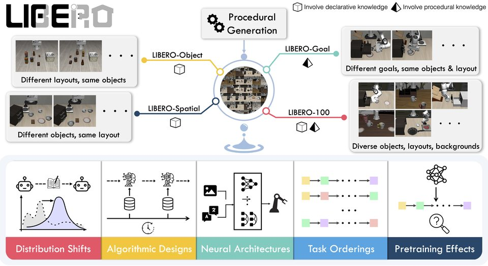

# LunaVLA: IL/VA Core for VLA Beginners


**Run the IL/VA core behind a tiny VLA-style project: `observation -> action -> rollout -> evaluation`, then turn the result into beginner-friendly embodied AI project evidence.**

给 VLA / 具身智能初学者：如果你学过概念，但还缺少一个能跑、能改、能讲清楚的项目，LunaVLA 用一个轻量 imitation-learning 闭环，帮助你从数据记录、策略训练、rollout 评估到结果展示完整走一遍。

LunaVLA is inspired by MiniMind's low-cost learning spirit, but it is an independent educational project and is not affiliated with, endorsed by, or maintained by the original MiniMind authors. It focuses on a teaching-scale action-learning baseline plus a small Task Layer, not real-robot deployment, frontier robot foundation model training, or state-of-the-art robotics claims.



## Learning Path

| Step | Start Here | What You Get |
| --- | --- | --- |
| Start it | `python scripts/run_quickstart.py` | Environment check, dataset inspection, CPU smoke, first-run checklist, and troubleshooting guide. |
| Check it | `python scripts/check_environment.py` | Python/dependency/path readiness before the first run. |
| Find it | `python scripts/generate_command_reference.py` | A command-to-artifact map for choosing the next step. |
| Read it | `python scripts/generate_code_walkthrough.py` | A guided reading order for the runnable code path. |
| Run it | `python scripts/run_cpu_smoke.py` | A tiny training run, rollout evaluation, summary, and rollout browser artifact. |
| Verify it | `python scripts/check_task_layer.py` | A fast check that records, rollout frames, summaries, reports, and the browser expose Task Layer context. |
| Trace it | `python scripts/generate_task_understanding_report.py` | A rollout-trace report that counts failed phases/subtasks and first-pass task labels. |
| Contract it | `python scripts/check_policy_interface.py` | A small interface check for `forward`, `predict_action`, `save_pretrained`, and `from_pretrained`. |
| Clone it | `python scripts/run_bc_smoke.py` | A from-scratch behavior cloning MLP smoke run with rollout evidence. |
| Tune it | `python scripts/run_policy_tuning_comparison.py` | Compare two BC hidden sizes with the same dataset, eval fields, and report format. |
| Ladder it | `python scripts/generate_policy_ladder.py` | A BC-to-ACT comparison that explains why rollout evidence matters beyond supervised loss. |
| Fix it | `python scripts/generate_troubleshooting_guide.py` | A symptom-to-command guide when an artifact is missing or a run needs debugging. |
| Understand it | `python scripts/inspect_dataset.py` | One VLA sample, model input vector, and ACT-style action chunk target. |
| Chunk it | `python scripts/generate_action_chunk_lesson.py` | A data-backed ACT/action-chunk lesson tied to the current config and checkpoint. |
| Scale it | `python scripts/generate_action_statistics.py` | Action mean/std, clip fraction, and normalization formulas for the demonstration data. |
| Analyze it | `python scripts/generate_action_analysis_report.py` | Compare train-time action targets with eval-time executable rollout actions. |
| Evaluate it | `python scripts/run_extended_evaluation.py` | Rerun more rollout episodes, save demos, and compare success rate with final distance. |
| Load it | `python scripts/run_jsonl_data_smoke.py` | Export local PushT-style JSONL, reload it with `dataset.source: jsonl`, then train/eval/report. |
| Stress it | `python scripts/run_data_quality_comparison.py` | Compare clean vs noisy local JSONL demonstrations with the same policy/eval shape. |
| Explain it | `python scripts/generate_learning_checkpoint.py` | Concept-to-evidence self-check questions for VLA beginners. |
| Practice it | `python scripts/generate_interview_flashcards.py` | Evidence-backed interview flashcards tied to code and run artifacts. |
| Map it | `python scripts/generate_skill_evidence_map.py` | A skill-to-code-to-artifact map for project reports and interview prep. |
| Report it | `python scripts/diagnose_run.py --run-dir outputs/act_pusht_baseline` | A claim-safety check, resume-safe bullets, a two-minute pitch, and honest boundaries. |
| Review it | `python scripts/generate_failure_review.py` | A cross-run failure review for rollout behavior and inspection notes. |
| Compare it | `python scripts/generate_config_diff.py` | A config-level audit for the baseline vs ablation setup. |
| Show it | `python scripts/check_readme_assets.py` | A quality check for README GIFs, screenshots, and result visuals. |
| Track it | `python scripts/check_project_progress.py` | A stage checklist for generated project evidence. |
| Package it | `python scripts/generate_project_card.py` | A one-page project card with commands, metrics, evidence, and boundaries. |
| Audit it | `python scripts/generate_experiment_ledger.py` | A config, metric, command, and artifact ledger for reproducible claims. |
| Finalize it | `python scripts/check_reviewer_readiness.py` | A final reviewer checklist for commands, artifacts, boundaries, and public-safe claims. |
| Share it | `python scripts/generate_showcase_issue.py` | A copyable learner showcase draft for public sharing. |
| Extend it | `docs/internship_pack/07_advanced_project_path.md` | A safe path for improving the baseline after the runnable loop works. |

## Quick Results

The PushT comparison below uses saved local LeRobot evaluation media. Use the asset export command to refresh the README media manifest after a checked local run:

```bash
python scripts/export_readme_assets.py --run-dir outputs/act_pusht_baseline --out-dir images
python scripts/generate_homepage_summary.py
```



| Checked run | Episodes | Success rate | Mean final distance | What to say |
| --- | --- | --- | --- | --- |
| ACT baseline | 20 | 1.0 | 0.08754 | Strong for this teaching eval; inspect saved rollouts before claiming robustness. |
| BC MLP | 20 | 0.35 | 0.178983 | Often gets near the goal but does not reliably satisfy the success threshold. |
| Noisy JSONL | 20 | 0.5 | 0.135869 | Mixed result; compare success rate with final distance and inspect failure cases. |

| ACT PushT eval | Diffusion Policy PushT eval |
| --- | --- |
|  |  |



## Robotics Visual Context

The ACT and Diffusion Policy PushT animations above are visual context from saved local LeRobot evaluation videos. The runnable evidence in this repo is the local PushT-style teaching loop, metrics, rollout browser, and generated reports. The visuals below are ecosystem references from official LeRobot and LIBERO project media, included to help beginners connect this tiny loop to broader robot-learning workflows.

| LeRobot robot control | LeRobot SO-100 demo | LeRobot VLA overview |
| --- | --- | --- |
|  |  |  |

| LIBERO simulation tasks | Refresh media | Attribution |
| --- | --- | --- |
|  | `python scripts/prepare_homepage_media.py` | [Visual attributions](docs/visual_attributions.md) |


## Quick Start

```bash
pip install -r requirements.txt
python scripts/run_quickstart.py
```

The quickstart command runs environment checks, dataset inspection, CPU smoke training/evaluation, first-run checklist generation, and troubleshooting guide generation. Local artifacts are written to `outputs/` and ignored by Git.

If you prefer the manual path, run the same first steps one by one:

```bash
python scripts/check_environment.py
python scripts/run_cpu_smoke.py
python scripts/generate_first_run_checklist.py
python scripts/generate_troubleshooting_guide.py
python scripts/generate_command_reference.py
python scripts/generate_code_walkthrough.py
python scripts/generate_action_chunk_lesson.py
```

Inspect one dataset sample before training:

```bash
python scripts/inspect_dataset.py
```

Validate the runnable configs:

```bash
python scripts/validate_configs.py
```

Check fast negative cases for release utilities:

```bash
python scripts/check_negative_paths.py
```

Check Task Layer evidence after smoke or baseline artifacts exist:

```bash
python scripts/check_task_layer.py
python scripts/generate_task_understanding_report.py
```

Check the tiny policy interface contract:

```bash
python scripts/check_policy_interface.py
```

Run the behavior cloning smoke baseline:

```bash
python scripts/run_bc_smoke.py
```

Run a small BC hidden-size tuning comparison:

```bash
python scripts/run_policy_tuning_comparison.py
```

Run the baseline evidence path:

```bash
python scripts/run_baseline_evidence.py
```

Run a stronger evaluation pass after checkpoints exist:

```bash
python scripts/run_extended_evaluation.py
```

Generate the BC-to-ACT policy ladder after BC smoke and baseline evidence exist:

```bash
python scripts/generate_policy_ladder.py
```

Generate action statistics and normalization notes:

```bash
python scripts/generate_action_statistics.py
python scripts/generate_action_analysis_report.py
```

Run the optional JSONL data smoke path after the baseline works:

```bash
python scripts/export_pusht_jsonl_dataset.py
python scripts/run_jsonl_data_smoke.py
python scripts/run_data_quality_comparison.py
```

Or run the same baseline path step by step:

```bash
python trainer/train_act_pusht.py --config configs/act_pusht_baseline.yaml
python eval_vla.py --checkpoint outputs/act_pusht_baseline/checkpoint.pt --episodes 50 --save-rollouts
python scripts/summarize_results.py --run-dir outputs/act_pusht_baseline
python scripts/generate_project_report.py --run-dir outputs/act_pusht_baseline
python scripts/generate_resume_pack.py --run-dir outputs/act_pusht_baseline
python scripts/diagnose_run.py --run-dir outputs/act_pusht_baseline
python scripts/generate_action_chunk_lesson.py --config configs/act_pusht_baseline.yaml --run-dir outputs/act_pusht_baseline
python scripts/export_readme_assets.py --run-dir outputs/act_pusht_baseline --out-dir images
python scripts/run_quickstart.py --skip-run
python scripts/generate_first_run_checklist.py
python scripts/generate_troubleshooting_guide.py
python scripts/generate_command_reference.py
python scripts/generate_code_walkthrough.py
python scripts/generate_failure_review.py
python scripts/check_readme_assets.py
python scripts/check_project_progress.py
python scripts/generate_learning_checkpoint.py
python scripts/generate_interview_flashcards.py
python scripts/generate_skill_evidence_map.py
python scripts/generate_project_card.py
python scripts/generate_experiment_ledger.py
python scripts/generate_showcase_issue.py
```

Run the chunk-size ablation:

```bash
python scripts/run_ablation_evidence.py
```

Or run the same ablation path step by step:

```bash
python trainer/train_act_pusht.py --config configs/act_pusht_ablation_chunk_size.yaml
python eval_vla.py --checkpoint outputs/act_pusht_ablation_chunk_size/checkpoint.pt --episodes 50 --save-rollouts
python scripts/summarize_results.py --run-dir outputs/act_pusht_ablation_chunk_size
python scripts/generate_project_report.py --run-dir outputs/act_pusht_ablation_chunk_size
python scripts/diagnose_run.py --run-dir outputs/act_pusht_ablation_chunk_size
python scripts/compare_runs.py --runs outputs/act_pusht_baseline outputs/act_pusht_ablation_chunk_size --out outputs/run_comparison.md
python scripts/generate_config_diff.py
python scripts/generate_resume_pack.py --run-dir outputs/act_pusht_baseline --comparison outputs/run_comparison.md
```

Build a complete evidence index after running the core paths:

```bash
python scripts/build_evidence_pack.py --skip-runs
```

Build a compact submission pack for project review:

```bash
python scripts/build_submission_pack.py
```

Check release readiness after the evidence artifacts exist:

```bash
python scripts/check_reviewer_readiness.py
python scripts/check_release_readiness.py
```

## What You Build

LunaVLA is intentionally small, but it includes the pieces a VLA internship project should be able to explain:

- data records with `observation`, `action`, `episode_id`, `timestep`, `success`, `task_id`, `subtask_id`, `phase`, and `metadata`;
- environment checks for Python, dependencies, repo files, and output write access;
- one-command quickstart for the smallest beginner path;
- a PushT-style demonstration generator;
- a local JSONL export/reload smoke path for learning `dataset.source: jsonl`;
- a clean-vs-noisy JSONL data-quality comparison for explaining how demonstrations affect rollout behavior;
- a from-scratch behavior cloning MLP smoke baseline;
- an ACT-style action chunk policy;
- a minimal policy interface with `forward`, `predict_action`, `save_pretrained`, and `from_pretrained`;
- config-driven training and checkpoint export;
- first-run checklist for checking the smallest runnable loop before moving on;
- troubleshooting guide for mapping common symptoms to files and recovery commands;
- command reference for mapping public commands to generated artifacts;
- code walkthrough for reading the runnable implementation in order;
- action chunk lesson for understanding ACT-style future-action targets;
- action statistics for explaining action scale, clipping, and normalization boundaries;
- policy ladder report that compares BC and ACT with rollout metrics;
- Task Layer diagnostics that label rollout frames as `approach_block`, `align_push`, `push_to_goal`, or `settle`;
- rollout evaluation with success rate, final distance, rollout length, and action smoothness;
- failure-case logging with first-pass category counts, failure subtask counts, result summaries, project reports, run diagnostics, resume/interview packs, README assets, and a static rollout browser.
- failure review across smoke, baseline, and ablation runs.
- config diff for checking which settings changed in the ablation.
- learning checkpoint that maps VLA concepts to code evidence and self-check questions.
- interview flashcards that connect common questions to code files and generated run evidence.
- skill evidence map that connects beginner-facing abilities to code, commands, and artifacts.
- README asset checks for ACT/Diffusion Policy PushT media and ecosystem visuals.
- project progress checks that map generated artifacts to report-ready stages.
- a one-page project card for quickly reviewing commands, metrics, evidence files, and honest boundaries.
- an experiment ledger that ties commands, config hashes, metrics, and artifacts together.
- a learner showcase draft for sharing reproducible project evidence without overclaiming.
- a compact `outputs/submission_pack/` folder for reviewing the final project evidence.

Mock PushT is the low-cost teaching layer. The optional JSONL smoke path shows how the same records can be saved as a local file and reloaded through config before moving to heavier robotics stacks.

## From IL/VA To Larger VLA Systems

LunaVLA starts with the IL/VA core because that is the smallest loop a beginner can run and explain: demonstrations become action targets, policies predict actions or action chunks, and rollout evaluation checks behavior. Larger VLA systems add stronger vision/language backbones, richer robot datasets, language-conditioned task variation, benchmark adapters, and deployment constraints after this core loop is understood.

Use LunaVLA as a first runnable bridge before studying LeRobot, OpenVLA, or openpi-style systems. Do not describe this repo as a reproduction of those projects; describe it as a small project that teaches the data, policy, rollout, report, and failure-analysis habits needed before moving into them.

## Internship Pack

If your goal is to turn the runnable loop into learning, resume, or interview evidence, start here:

- `docs/internship_pack/01_vla_internship_skill_map.md`: what the project teaches.
- `docs/internship_pack/02_resume_bullets.md`: resume bullets matched to completed work.
- `docs/internship_pack/03_interview_qa.md`: interview answers for VLA, behavior cloning, ACT, rollout, and failure analysis.
- `docs/internship_pack/04_project_report_template.md`: experiment report template, or generate a first draft with `scripts/generate_project_report.py`.
- `docs/internship_pack/05_jd_to_project_mapping.md`: map JD keywords to code evidence.
- `docs/internship_pack/06_4_week_project_path.md`: four-week learning path.
- `docs/internship_pack/07_advanced_project_path.md`: stronger project path after the baseline works.

## Release Materials

- [DATA_CARD.md](DATA_CARD.md): what the teaching data is and is not.
- [MODEL_CARD.md](MODEL_CARD.md): what the tiny policy is intended for.
- [RELEASE_NOTES.md](RELEASE_NOTES.md): what this public release includes.
- [docs/visual_attributions.md](docs/visual_attributions.md): sources and licenses for README ecosystem media.
- [docs/tutorials/action_chunking_act.md](docs/tutorials/action_chunking_act.md): a static ACT/action-chunking tutorial.
- [docs/tutorials/behavior_cloning_from_scratch.md](docs/tutorials/behavior_cloning_from_scratch.md): a from-scratch behavior cloning tutorial.
- [docs/tutorials/action_normalization.md](docs/tutorials/action_normalization.md): why action stats matter before larger robot-learning stacks.

## Share A Run

Use GitHub issues to report a bug, share an experiment, or post a learner showcase. Good reports include the exact command, metrics, rollout evidence, and an honest boundary statement.

## Repository Layout

```text
lunavla/
  configs/              # CPU smoke, JSONL smoke, baseline, and ablation configs
  data/examples/        # Small tracked JSONL sample for the optional stronger-data path
  dataset/              # VLA record schema and PushT-style data generator
  docs/                 # learning notes, evaluation guide, and internship pack
  images/               # README-visible PushT media, architecture, and ecosystem assets
  model/                # tiny policy and ACT-style wrapper
  scripts/              # dataset inspection, evidence runners, reports, resume packs, assets, and web demo generator
  trainer/              # training entrypoints and shared utilities
  eval_vla.py           # rollout evaluation entrypoint
```

## Data Schema

Each training record follows this shape:

```json
{
  "observation": [0.12, 0.33, 0.80, 0.20],
  "action": [0.05, -0.02],
  "episode_id": 0,
  "timestep": 3,
  "success": false,
  "language_instruction": "push the T block to the goal",
  "metadata": {"task": "pusht_mock"}
}
```

## Honest Claim

LunaVLA is a tiny, readable, reproducible project starter for learning observation-to-action training. It is not a real-robot deployment benchmark and does not claim state-of-the-art robotics performance.

## License

Apache-2.0. This repository is built as an educational and internship-oriented VLA scaffold.
