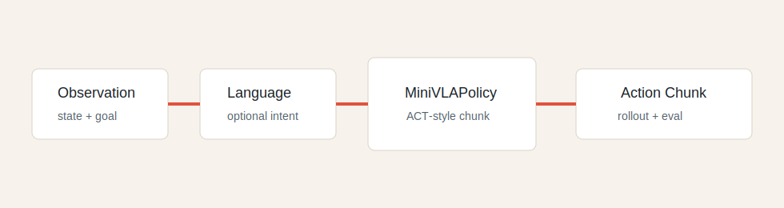
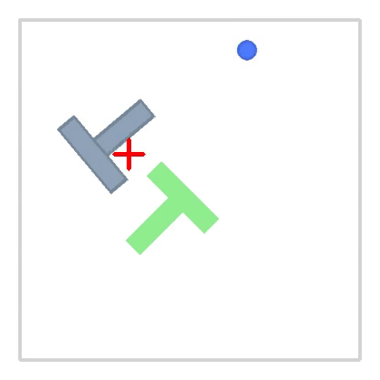
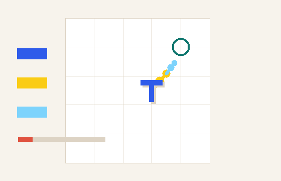
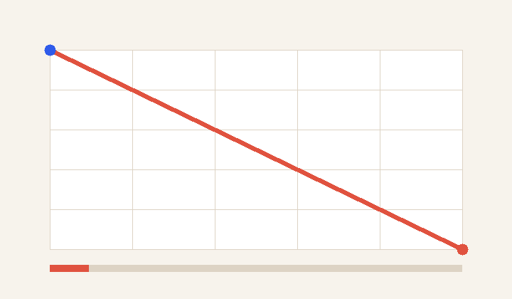
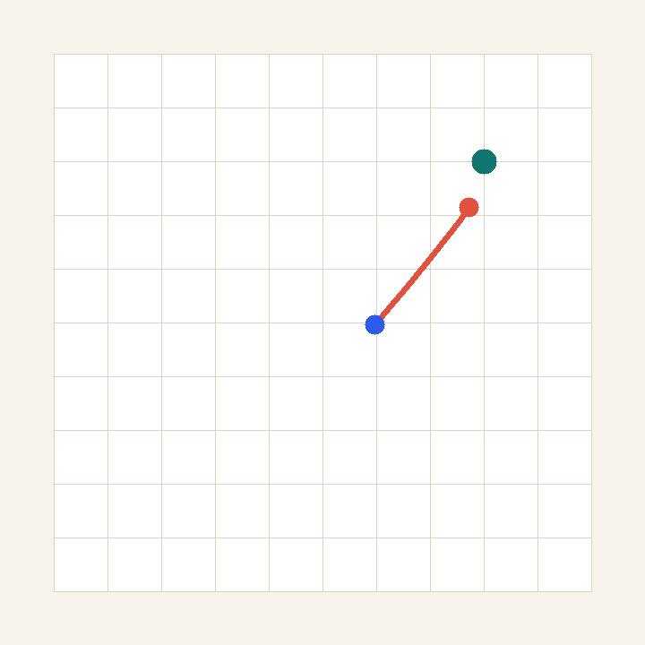
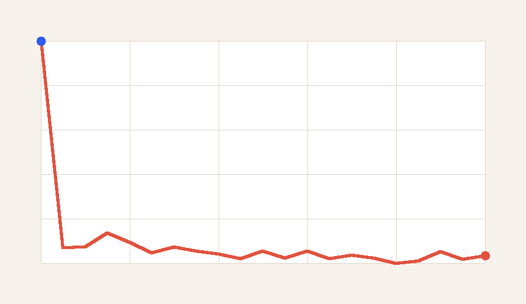
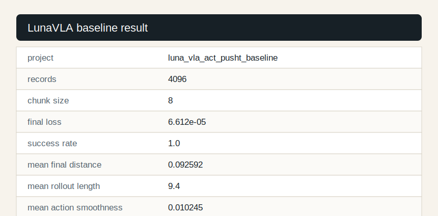

# MiniMind-VLA: A Tiny VLA Project Starter You Can Run


**Run a tiny VLA loop: `observation -> action -> rollout -> evaluation`, then turn the result into beginner-friendly embodied AI project evidence.**

给 VLA / 具身智能新手：如果你学过概念但缺少一个能跑、能改、能讲清楚的项目，MiniMind-VLA 用一个轻量 imitation-learning 闭环，帮助你从数据记录、策略训练、rollout 评估到结果展示完整走一遍。

This repo follows the spirit of MiniMind: low cost, reproducible, readable from code, and useful for learners. It focuses on a teaching-scale action-learning baseline, not real-robot deployment, frontier robot foundation model training, or state-of-the-art robotics claims.



## Learning Path

| Step | Start Here | What You Get |
| --- | --- | --- |
| Run it | `python scripts/run_cpu_smoke.py` | A tiny training run, rollout evaluation, summary, and static demo artifact. |
| Understand it | `docs/internship_pack/01_vla_internship_skill_map.md` | The core VLA project concepts behind data, policy, rollout, and metrics. |
| Report it | `python scripts/generate_project_report.py --run-dir outputs/act_pusht_baseline` | A project report for results, failure cases, and honest claims. |
| Extend it | `docs/internship_pack/07_advanced_project_path.md` | A safe path for improving the baseline after the runnable loop works. |

## Quick Results

The animations and images below are generated from a checked local run:

```bash
python scripts/export_readme_assets.py --run-dir outputs/act_pusht_baseline --out-dir images
```

| PushT rollout | ACT action chunk | Training loss |
| --- | --- | --- |
|  |  |  |

| Static rollout | Loss curve | Result table |
| --- | --- | --- |
|  |  |  |


## Quick Start

```bash
pip install -r requirements.txt
python scripts/run_cpu_smoke.py
```

This single command runs training, evaluation, summary generation, project report generation, and a static HTML rollout demo. Local artifacts are written to `outputs/cpu_smoke/` and ignored by Git.

Run the baseline evidence path:

```bash
python scripts/run_baseline_evidence.py
```

Or run the same baseline path step by step:

```bash
python trainer/train_act_pusht.py --config configs/act_pusht_baseline.yaml
python eval_vla.py --checkpoint outputs/act_pusht_baseline/checkpoint.pt --episodes 50 --save-rollouts
python scripts/summarize_results.py --run-dir outputs/act_pusht_baseline
python scripts/generate_project_report.py --run-dir outputs/act_pusht_baseline
python scripts/export_readme_assets.py --run-dir outputs/act_pusht_baseline --out-dir images
```

Run the chunk-size ablation:

```bash
python trainer/train_act_pusht.py --config configs/act_pusht_ablation_chunk_size.yaml
python eval_vla.py --checkpoint outputs/act_pusht_ablation_chunk_size/checkpoint.pt --episodes 50 --save-rollouts
python scripts/summarize_results.py --run-dir outputs/act_pusht_ablation_chunk_size
python scripts/generate_project_report.py --run-dir outputs/act_pusht_ablation_chunk_size
python scripts/compare_runs.py --runs outputs/act_pusht_baseline outputs/act_pusht_ablation_chunk_size --out outputs/run_comparison.md
```

## What You Build

MiniMind-VLA is intentionally small, but it includes the pieces a VLA internship project should be able to explain:

- data records with `observation`, `action`, `episode_id`, `timestep`, `success`, and `metadata`;
- a PushT-style demonstration generator;
- an ACT-style action chunk policy;
- config-driven training and checkpoint export;
- rollout evaluation with success rate, final distance, rollout length, and action smoothness;
- failure-case logging, result summaries, project reports, README assets, and a static web demo.

Mock PushT is the low-cost teaching layer. Its value is helping you understand the data, policy, rollout, evaluation, and reporting loop before moving to heavier robotics stacks.

## Internship Pack

If your goal is to turn the runnable loop into learning, resume, or interview evidence, start here:

- `docs/internship_pack/01_vla_internship_skill_map.md`: what the project teaches.
- `docs/internship_pack/02_resume_bullets.md`: resume bullets matched to completed work.
- `docs/internship_pack/03_interview_qa.md`: interview answers for VLA, behavior cloning, ACT, rollout, and failure analysis.
- `docs/internship_pack/04_project_report_template.md`: experiment report template, or generate a first draft with `scripts/generate_project_report.py`.
- `docs/internship_pack/05_jd_to_project_mapping.md`: map JD keywords to code evidence.
- `docs/internship_pack/06_4_week_project_path.md`: four-week learning path.
- `docs/internship_pack/07_advanced_project_path.md`: stronger project path after the baseline works.

## Share A Run

Use GitHub issues to report a bug, share an experiment, or post a learner showcase. Good reports include the exact command, metrics, rollout evidence, and an honest boundary statement.

## Repository Layout

```text
minimind-vla/
  configs/              # CPU smoke, baseline, and ablation configs
  dataset/              # VLA record schema and PushT-style data generator
  docs/                 # learning notes, evaluation guide, and internship pack
  images/               # README-visible rollout, loss, architecture, and result assets
  model/                # tiny policy and ACT-style wrapper
  scripts/              # smoke/baseline runners, summaries, reports, assets, and web demo generator
  trainer/              # training entrypoints and shared utilities
  eval_vla.py           # rollout evaluation entrypoint
```

## Data Schema

Each training record follows this shape:

```json
{
  "observation": [0.12, 0.33, 0.80, 0.20],
  "action": [0.05, -0.02],
  "episode_id": 0,
  "timestep": 3,
  "success": false,
  "language_instruction": "push the T block to the goal",
  "metadata": {"task": "pusht_mock"}
}
```

## Honest Claim

MiniMind-VLA is a tiny, readable, reproducible project starter for learning observation-to-action training. It is not a real-robot deployment benchmark and does not claim state-of-the-art robotics performance.

## License

Apache-2.0. This repository is built as an educational and internship-oriented VLA scaffold.
